# LR6
## Лабораторная работа №6

**Цель работы:** изучение базовых возможностей системы управления версиями, опыт работы с Git Api, опыт работы с локальным и удаленным репозиторием.

**Ход работы**

1. Создан аккаунт на сайте GitHub
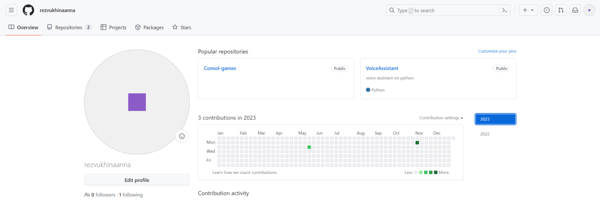

2. Создана копия исходного репозитория в личное хранилище
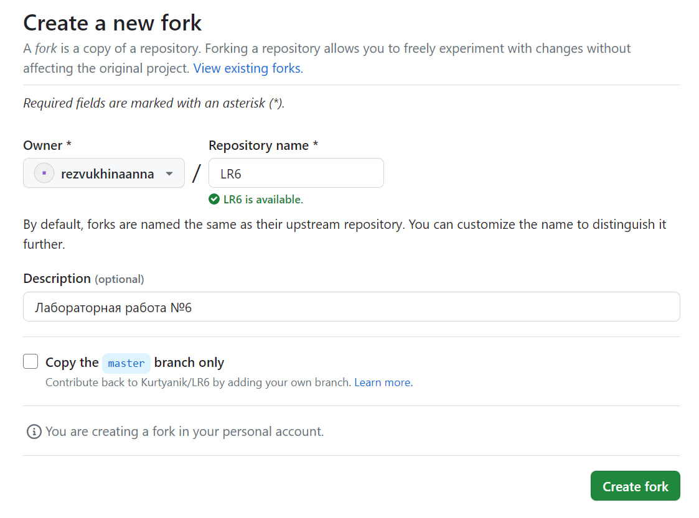

3. Установлен Git
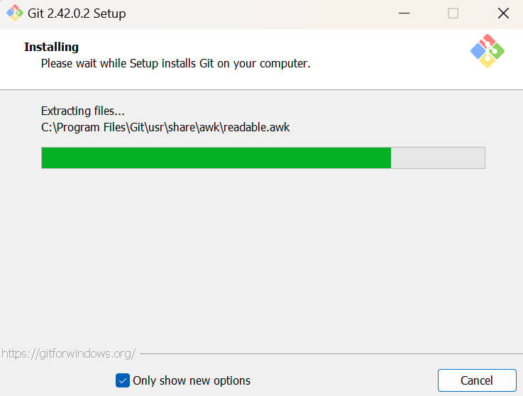

4. Настроен клиент Git (введено имя пользователя и email) с помощью команд `git config --global user.name <имя>` и `git config --global user.email <почта>`
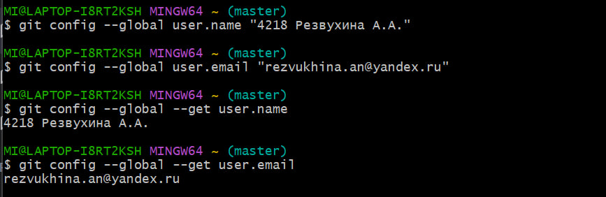

5. Клонирован личный удалённый репозиторий на компьютер с помощью `git clone`
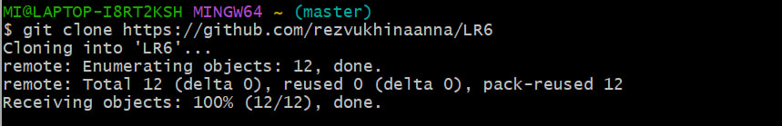

6. Добавлен файл через интерфейс GitHub
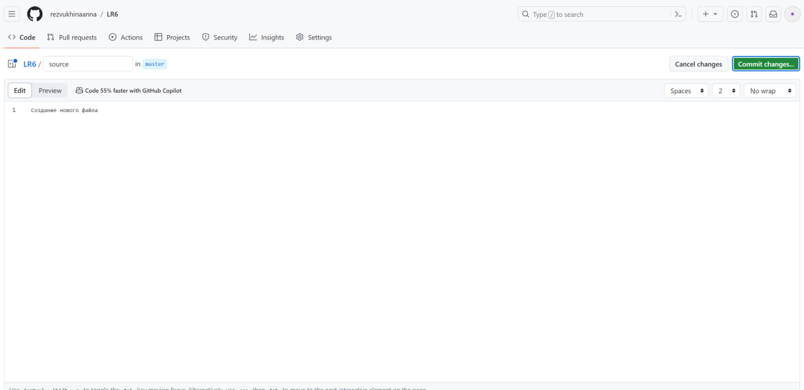

Изменения подтянуты в локальный репозиторий (переход в локальный репозиторий - `cd LR6 `,  "подтягивание" - `git pull`)
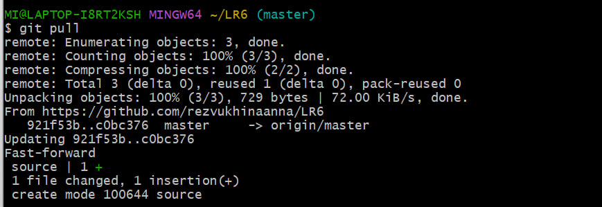

> Далее работа продолжена локально

7. Получена история операций веток с помощью `git log`

Для **master**
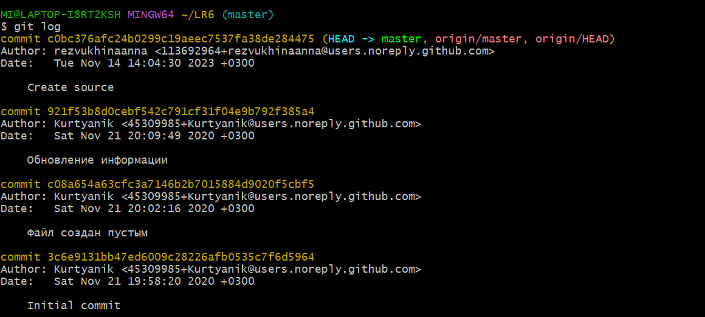

Для **branch1**
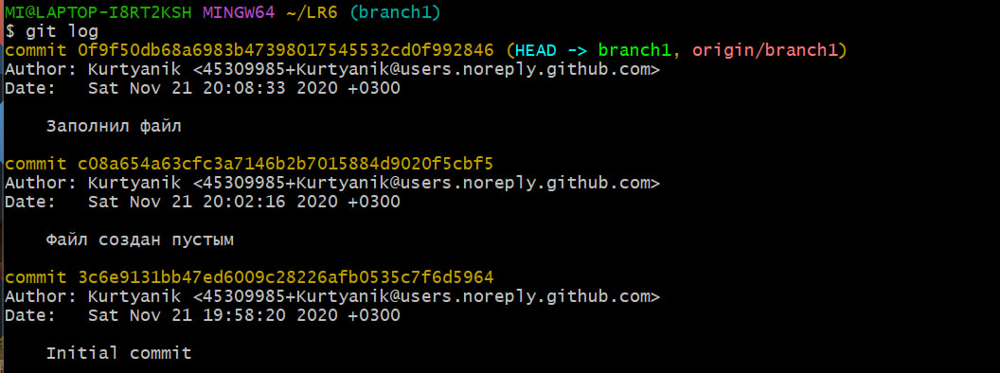

8. Просмотрены последние изменения ветки master с помощью `git log --all --graph --oneline`
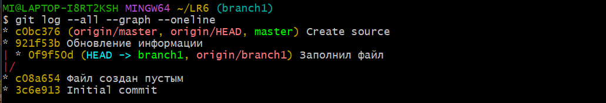

9. Выполнено слияние веток с помощью `git merge branch1`, просматрено состояние проекта, используя `git status` и разрешен конфликт по данной ситуации с помощью `git add <file>`
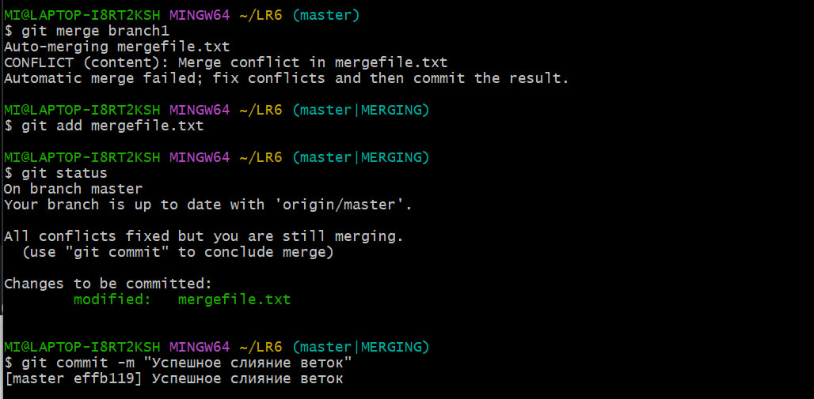

10. Удаление побочной ветки после слияния с помощью `git branch -d <ветка>`
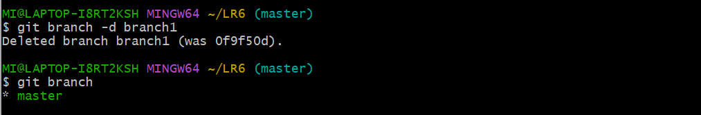

11. Проведены и зафиксированы изменения, используемые команды:
- `echo текст_изменения > файл_для_сохранения`
- `git add <файл>`
- `git commit -m "изменение n"`

Первое изменение
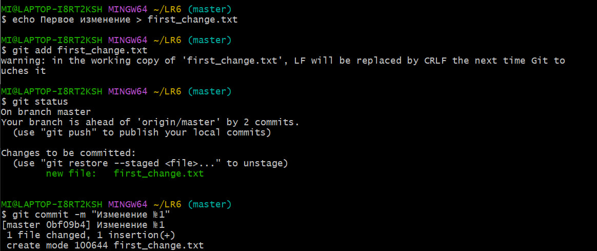

Второе изменение
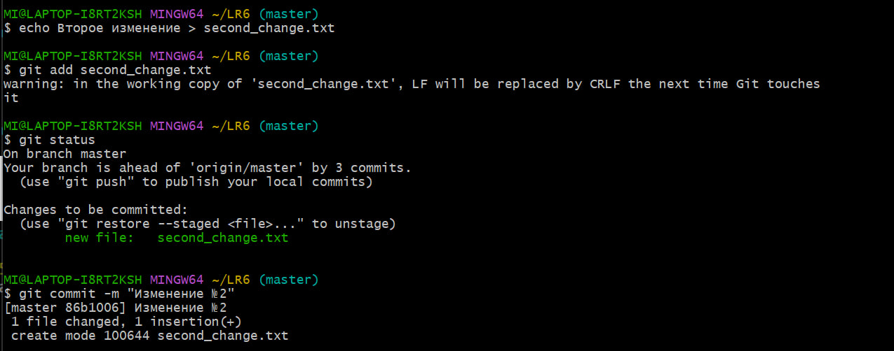

Просмотр историй операций с помощью `git log -2`
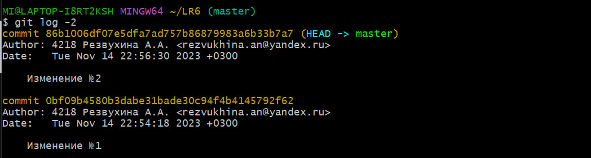

12. Сделан откат коммита с помощью `git reset HEAD~1` и проверка истории изменений с помощью `git log -2`
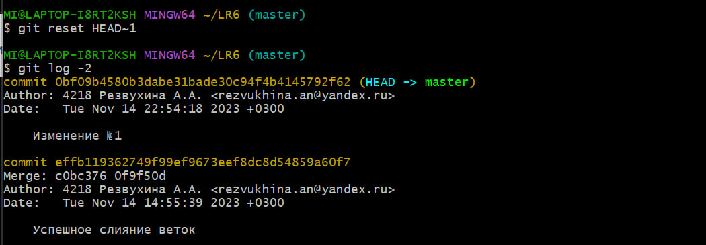

13. Создана ветка для отчёта branch2 с помощью `git branch branch2`
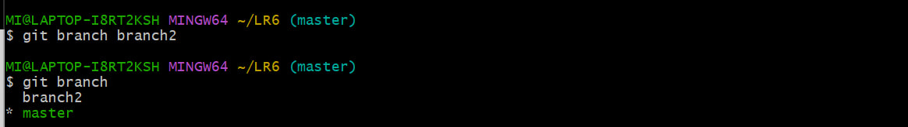

14. Оформлен отчет в редакторе Notepad
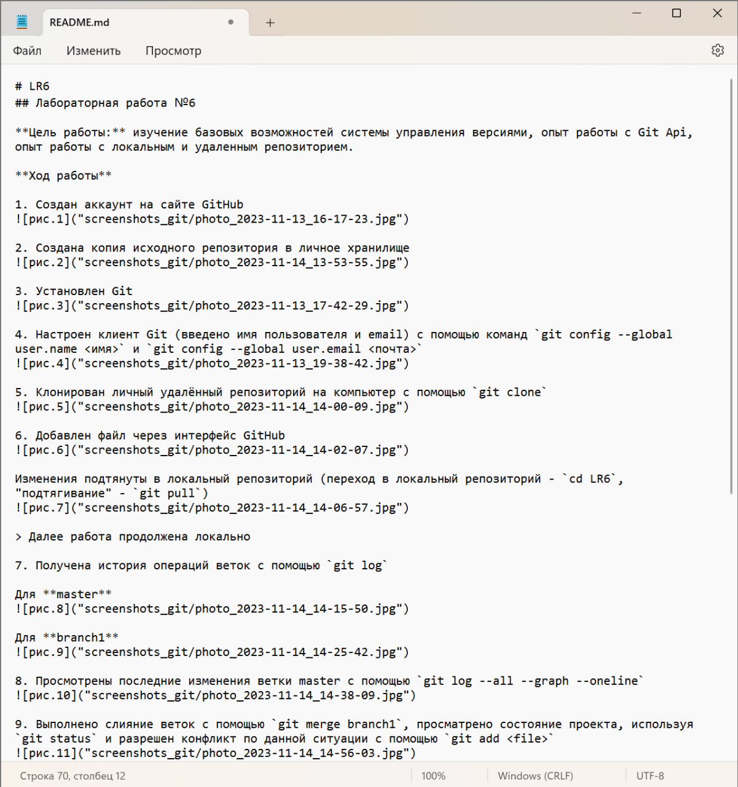

15. Получена история операций в форматированном виде
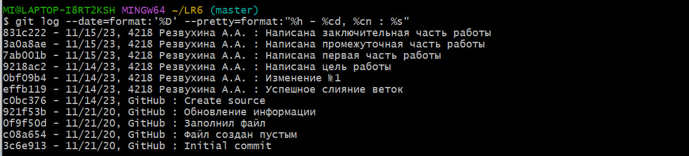

16. Лог всех команд
git config - настройки  
git clone - клонирование репозитория  
git pull - извлечение и загрузка содержимого из удаленного репозитория  
git log --all --graph --oneline - вывод компактного графа истории коммитов  
git checkout - переключениt между ветками  
git log -p -2 - просмотр историй коммитов с показом изменений, внесенных в каждом коммите  
git merge - объединение изменений из одной ветки в другую  
git status - показывает состояния файлов в рабочем каталоге  
git add - добавление изменений в индекс  
git commit -m "Text" - делает для проекта снимок текущего состояния изменений, добавленных в раздел проиндексированных файлов  
git branch -d - удаление ветки  
git log --date=format:'%D' --pretty=format:"%h - %cd, %cn : %s" - вывод истории коммитов с форматированными данными  

**Вывод:** в ходе лабораторной работы были изучены базовые возможности системы управления версиями, также был получен опыт работы с Git Api и опыт работы с локальным и удаленным репозиторием.
